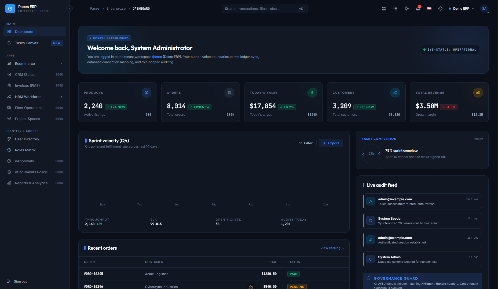

# 🛡️ Enterprise ERP (Multi-Tenant)



[](./package.json)
[](#tech-stack)
[](#core-architecture)

A high-performance, modular, and premium Enterprise Resource Planning (ERP) system designed for modern business operations. Built with a focus on strict data isolation, atomic business logic, and a state-of-the-art user experience.

---

## ✨ Core Features

- **🔐 Multi-Database Isolation**: Each tenant has its own physical database for maximum security and performance.
- **🏗️ Modular Architecture**: 12+ enterprise-ready modules (IAM, FMS, HRM, etc.) that can be scaled independently.
- **💎 Premium UI/UX**: Built with Nuxt 3 and PrimeVue, featuring dark mode, glassmorphism, and responsive layouts.
- **🚀 Agent-Ready**: Standardized skills and rules integrated for AI-assisted development and automation.

---

## 🛠️ Tech Stack

### Backend
- **Core**: Laravel 11+ (PHP 8.2+)
- **Database**: PostgreSQL (via `stancl/tenancy`)
- **Auth**: Laravel Passport (OAuth2 & OIDC)
- **Object Storage**: MinIO (dev) / AWS S3 · Cloudflare R2 (prod) — presigned-URL uploads, never on local disk. See [`docs/object-storage.md`](docs/object-storage.md).
- **Testing**: Pest PHP (Security & Tenancy focus)

### Frontend
- **Core**: Nuxt 3+ (Vue 3, TypeScript)
- **Styling**: Tailwind CSS 4+
- **UI Components**: PrimeVue (Premium presets)
- **State Management**: Pinia

---

## 📂 Project Structure

```bash
├── 📁 backend        # Laravel Multi-tenant RESTful API
├── 📁 frontend       # NuxtJS 3 Client application
├── 📁 skills         # Standardized Agent Skills (Business Logic)
├── 📁 rules          # Global Development Rules & Standards
├── 📁 tools          # Internal CLI Tools (e.g., skills-cli)
└── 📄 AGENTS.md      # Primary Agent Context
└── 📄 CONTEXT.md     # Project Single Source of Truth
```

---

## 🧭 Navigation & Standards

To maintain the integrity of this enterprise system, all contributors (human and AI) must adhere to the following:

- **[Project Context](./PROJECT_CONTEXT.md)**: The definitive guide to the system architecture.
- **[Agent Rules](./AGENTS.md)**: Behavioral guidelines and specialized skills.
- **[Modular Features](./skills/features.md)**: Detailed breakdown of the 12 core ERP modules.

---

## 🛠️ Quick Start

### 1. Prerequisites
- Docker Desktop (with Docker Compose v2)
- Node 20+ for the frontend (when present)

### 2. Boot the backend stack
```bash
# Clone the repository
git clone https://github.com/pphatdev/erp-prompt.git
cd erp-prompt

# Bring up nginx, php-fpm, queue worker, postgres, redis, minio
# (minio-init creates the `erp-uploads` bucket on first boot)
docker compose up -d

# Run central migrations + central seed (creates the Passport personal-access client)
docker compose exec app php artisan migrate --force
docker compose exec app php artisan db:seed --force
```

The API is now reachable at `http://localhost:8000`. The MinIO console is at `http://localhost:9001` (dev creds: `erp-dev-root` / `erp-dev-secret`).

### 3. Onboard your first tenant
```bash
# Create the tenant row + database (CreateDatabase + MigrateDatabase pipeline runs synchronously)
curl -X POST http://localhost:8000/api/tenants \
  -H "Content-Type: application/json" \
  -d '{"name":"Acme Corp","handle":"acme"}'

# Seed users, roles, permissions, and the per-tenant Passport client
docker compose exec app php artisan tenants:seed --tenants=acme
```

### 4. Log in
Tenant identification is **header-based** — every tenant-scoped request must include `tenant: <handle>`. No subdomain or hosts-file entry needed.

```bash
curl -X POST http://localhost:8000/api/auth/login \
  -H "Content-Type: application/json" \
  -H "tenant: acme" \
  -d '{"email":"admin@erp.local","password":"Admin@1234!"}'
```

Default seeded credentials (change before any non-local environment):

| Role | Email | Password |
|---|---|---|
| Super Admin | `admin@erp.local` | `Admin@1234!` |
| Staff | `staff@erp.local` | `Staff@1234!` |

### 5. Explore the API
Import [`docs/postman/erp_collection.json`](docs/postman/erp_collection.json) into Postman. The collection-level pre-request script adds `tenant: {{tenant_id}}` to every request and capture scripts chain `token`, `role_id`, and `permission_ids` automatically. Recommended run order: **Onboard Tenant → Login → List Permissions → Create Role → Sync Role Permissions → List Audit Logs**.

Full auth and tenant-header reference: [`docs/api-authentication.md`](docs/api-authentication.md).

Other reference docs:
- [`docs/object-storage.md`](docs/object-storage.md) — MinIO/S3 presigned-upload flow + dev/prod swap.
- [`docs/hrm-employee-creation.md`](docs/hrm-employee-creation.md) — HRM employee creation wizard ↔ backend integration (7 tenant tables + Cambodia geography + photo upload).

### 6. Frontend (optional)
```bash
cd frontend && npm install && npm run dev
```

---

## 📊 ERP Modules

| Identity & Access | Finance & HR | Supply Chain | Specialized |
| :--- | :--- | :--- | :--- |
| [IAM](./skills/iam) | [FMS](./skills/fms) | [Inventory](./skills/inventory) | [eApprovals](./skills/eapprovals) |
| [Sales](./skills/sales) | [HRM](./skills/hrm) | [Fleet](./skills/fleet) | [eDocuments](./skills/edocuments) |
| [Reporting](./skills/reporting) | [Projects](./skills/projects) | [Assets](./skills/assets) | [Documents](./skills/documents) |

---

## 📜 License
Internal Enterprise License. All rights reserved.

---
*Built with ⚠️ by [PPhat](https://github.com/pphatdev).* 
