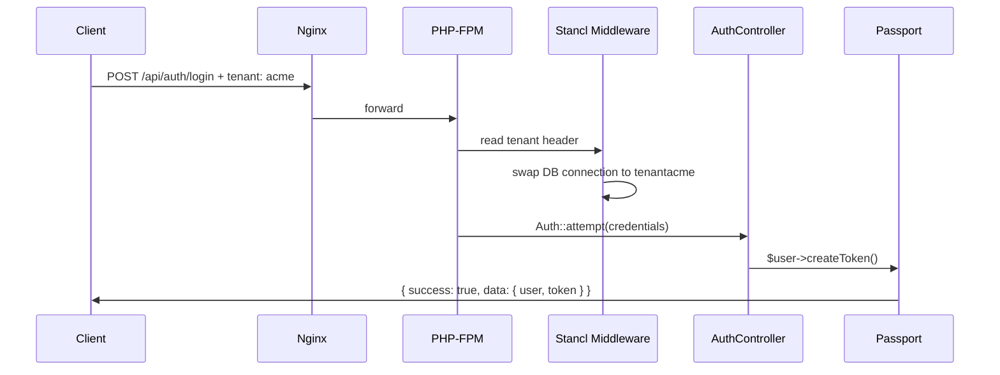

# API Authentication & Tenant Identification

## TL;DR

Every tenant-scoped request must carry the `tenant` header. No subdomain is needed.

```http
POST /api/auth/login HTTP/1.1
Host: localhost:8000
Content-Type: application/json
tenant: acme

{"email": "admin@erp.local", "password": "Admin@1234!"}
```

The server resolves the tenant from this header via Stancl's `InitializeTenancyByRequestData` middleware (see [TenancyServiceProvider.php](../backend/app/Providers/TenancyServiceProvider.php)) and swaps the active DB connection to that tenant's database before the controller runs.

---

## 1. Request Headers

| Header | Required for | Value | Notes |
|---|---|---|---|
| `tenant` | Every request under [routes/tenant.php](../backend/routes/tenant.php) | Tenant handle (e.g. `acme`) | Falls back to `?tenant=` query param if the header is absent. |
| `Authorization` | All routes inside the `auth:api` middleware group | `Bearer <token>` | Token obtained from `POST /api/auth/login`. |
| `Content-Type` | Any request with a JSON body | `application/json` | — |

The `tenant` header is **not** required for endpoints in [routes/api.php](../backend/routes/api.php) (currently only `POST /api/tenants`, which is the onboarding call that creates the tenant in the first place).

## 2. Authentication Flow



The login response shape:

```json
{
  "success": true,
  "data": {
    "user": { "id": "019e48c0-...", "email": "admin@erp.local", "role_id": "..." },
    "token": "eyJ0eXAiOiJKV1Qi..."
  }
}
```

## 3. Authenticated Requests

After login, every subsequent call needs both `tenant` (which tenant DB) and `Authorization` (which user):

```bash
curl -X GET http://localhost:8000/api/iam/roles \
  -H "tenant: acme" \
  -H "Authorization: Bearer eyJ0eXAi..."
```

Omitting `tenant` returns a 500 because tenancy never initializes and the auth guard tries to read `users` from the central DB (which has no `users` table).

## 4. Onboarding a New Tenant

The only endpoint that does **not** require `tenant` — because the tenant doesn't exist yet:

```bash
curl -X POST http://localhost:8000/api/tenants \
  -H "Content-Type: application/json" \
  -d '{"name":"Acme Corp","handle":"acme"}'
```

This synchronously fires Stancl's `CreateDatabase` + `MigrateDatabase` jobs ([TenancyServiceProvider.php](../backend/app/Providers/TenancyServiceProvider.php)). Seeding the tenant DB is a separate step:

```bash
docker compose exec app php artisan tenants:seed --tenants=acme
```

The tenant seeder inserts the per-tenant Passport personal-access client, default roles (`super-admin`, `staff`), the IAM permission catalog, and the seeded admin/staff users.

## 5. Default Seeded Credentials (Dev Only)

| Role | Email | Password |
|---|---|---|
| Super Admin | `admin@erp.local` | `Admin@1234!` |
| Staff | `staff@erp.local` | `Staff@1234!` |

Rotate these before any non-local environment.

## 6. Frontend Integration

The Nuxt `useApi` wrapper must inject the `tenant` header on every request:

```ts
// frontend/composables/useApi.ts (sketch)
export const useApi = () => {
  const tenant = useTenantHandle() // from route, cookie, or store
  const token  = useAuthToken()
  return $fetch.create({
    baseURL: useRuntimeConfig().public.apiBase,
    headers: {
      tenant: tenant.value,
      ...(token.value ? { Authorization: `Bearer ${token.value}` } : {}),
    },
  })
}
```

## 7. Common Errors

| Response | Cause | Fix |
|---|---|---|
| `Tenant could not be identified on domain localhost` | Old subdomain-based middleware still in routes file. | Confirm [routes/tenant.php](../backend/routes/tenant.php) uses `InitializeTenancyByRequestData`. |
| `{"success":false,"message":"Invalid credentials"}` | Tenant DB unseeded — no users exist. | `php artisan tenants:seed --tenants=<handle>` |
| `{"success":false,"message":"Personal access client not found ..."}` | Tenant DB has no `oauth_clients` row with the `personal_access` grant. | Same — re-run `tenants:seed`. |
| `{"success":false,"message":"Key file ... permissions are not correct ..."}` | Key files at `storage/oauth-*.key` have looser perms than 0660. | Container entrypoint auto-chmods to 0600 on boot. Outside Docker, `chmod 600 storage/oauth-*.key`. |
| `{"success":false,"message":"Invalid key supplied"}` | Passport looking at the wrong key path (tenancy rewrote `storage_path()`). | Confirm `Passport::loadKeysFrom(base_path('storage'))` is in [AppServiceProvider.php](../backend/app/Providers/AppServiceProvider.php). |

## 8. Postman

The bundled collection at [docs/postman/erp_collection.json](postman/erp_collection.json) injects the `tenant` header on every request via a collection-level pre-request script:

```js
const tenantId = pm.environment.get('tenant_id');
if (tenantId) {
    pm.request.headers.upsert({ key: 'tenant', value: tenantId });
}
```

Login + token capture is automatic — `{{token}}` is set on the environment when the Login request succeeds, so every downstream request inherits the `Authorization: Bearer ...` header without manual paste.
