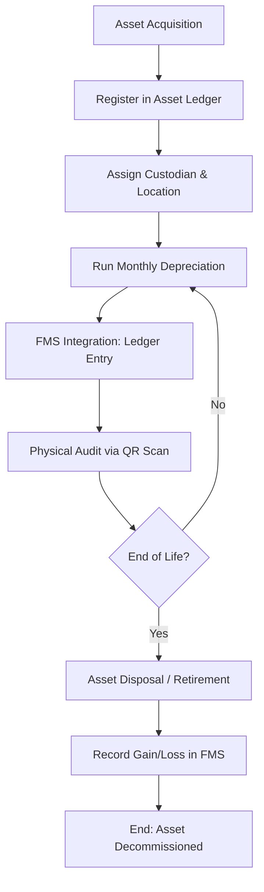

# Fixed Asset Lifecycle Flow

```mermaid
graph TD
    A[Asset Acquisition] --> B[Register in Asset Ledger]
    B --> C[Assign Custodian & Location]
    C --> D[Run Monthly Depreciation]
    D --> E[FMS Integration: Ledger Entry]
    E --> F[Physical Audit via QR Scan]
    F --> G{End of Life?}
    G -- Yes --> H[Asset Disposal / Retirement]
    G -- No --> D
    H --> I[Record Gain/Loss in FMS]
    I --> J[End: Asset Decommissioned]
```
