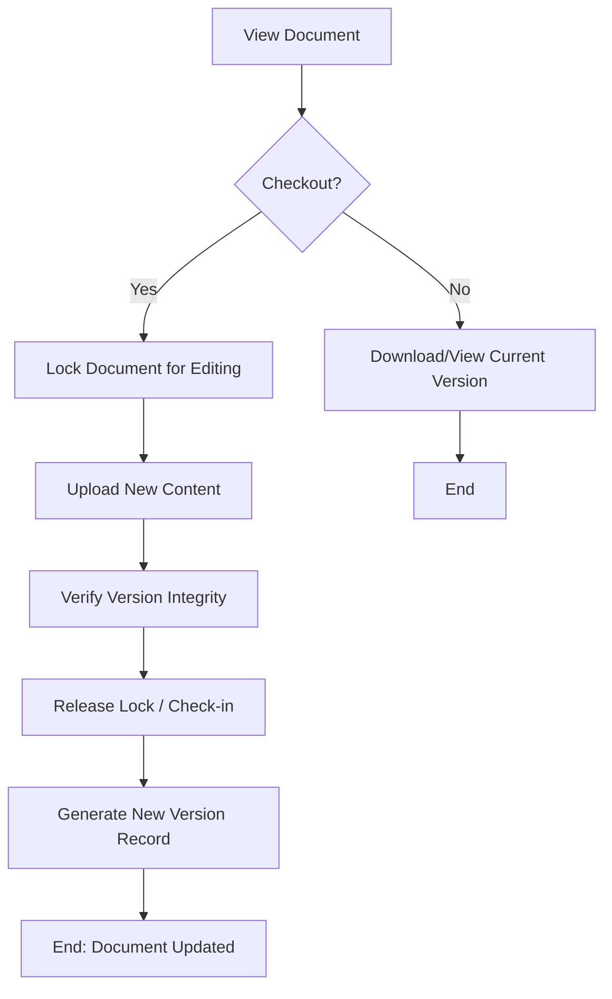

# Document Versioning & Checkout Flow

```mermaid
graph TD
    A[View Document] --> B{Checkout?}
    B -- Yes --> C[Lock Document for Editing]
    C --> D[Upload New Content]
    D --> E[Verify Version Integrity]
    E --> F[Release Lock / Check-in]
    F --> G[Generate New Version Record]
    G --> H[End: Document Updated]
    B -- No --> I[Download/View Current Version]
    I --> J[End]
```
