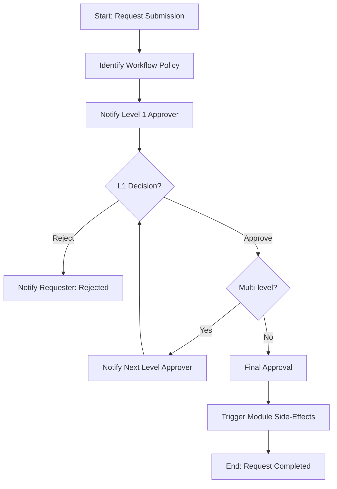

# eApprovals Workflow Flow

```mermaid
graph TD
    A[Start: Request Submission] --> B[Identify Workflow Policy]
    B --> C[Notify Level 1 Approver]
    C --> D{L1 Decision?}
    D -- Reject --> E[Notify Requester: Rejected]
    D -- Approve --> F{Multi-level?}
    F -- Yes --> G[Notify Next Level Approver]
    G --> D
    F -- No --> H[Final Approval]
    H --> I[Trigger Module Side-Effects]
    I --> J[End: Request Completed]
```
