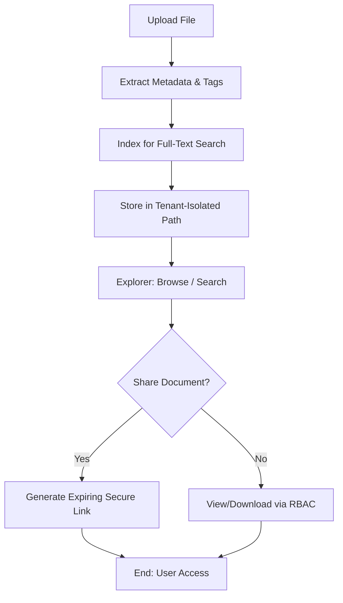

# eDocuments Explorer Flow

```mermaid
graph TD
    A[Upload File] --> B[Extract Metadata & Tags]
    B --> C[Index for Full-Text Search]
    C --> D[Store in Tenant-Isolated Path]
    D --> E[Explorer: Browse / Search]
    E --> F{Share Document?}
    F -- Yes --> G[Generate Expiring Secure Link]
    F -- No --> H[View/Download via RBAC]
    G --> I[End: User Access]
    H --> I
```
