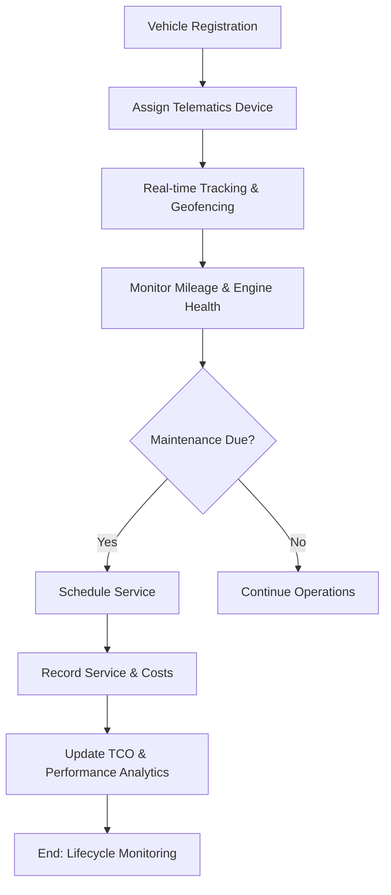

# Fleet Management Flow

```mermaid
graph TD
    A[Vehicle Registration] --> B[Assign Telematics Device]
    B --> C[Real-time Tracking & Geofencing]
    C --> D[Monitor Mileage & Engine Health]
    D --> E{Maintenance Due?}
    E -- Yes --> F[Schedule Service]
    E -- No --> G[Continue Operations]
    F --> H[Record Service & Costs]
    H --> I[Update TCO & Performance Analytics]
    I --> J[End: Lifecycle Monitoring]
```
