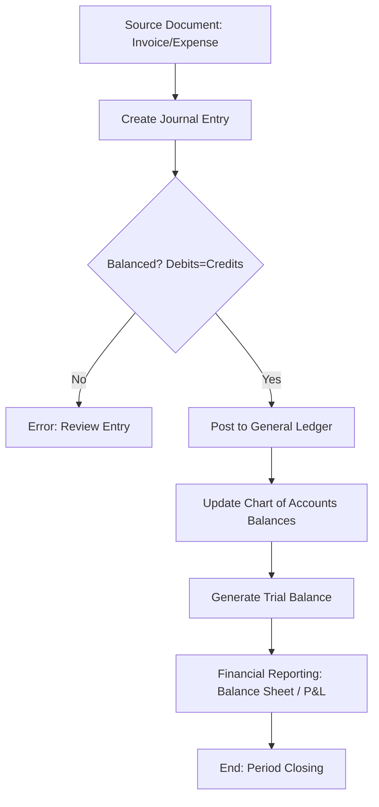

# FMS Transaction Flow

```mermaid
graph TD
    A[Source Document: Invoice/Expense] --> B[Create Journal Entry]
    B --> C{Balanced? Debits=Credits}
    C -- No --> D[Error: Review Entry]
    C -- Yes --> E[Post to General Ledger]
    E --> F[Update Chart of Accounts Balances]
    F --> G[Generate Trial Balance]
    G --> H[Financial Reporting: Balance Sheet / P&L]
    H --> I[End: Period Closing]
```
