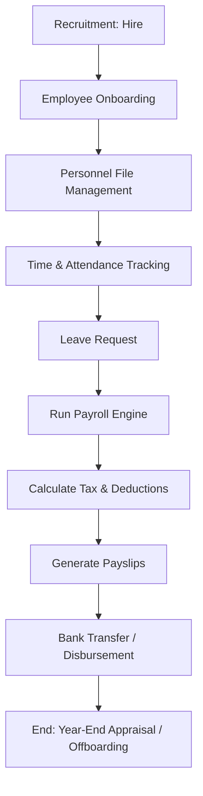

# HRM Lifecycle & Payroll Flow

```mermaid
graph TD
    A[Recruitment: Hire] --> B[Employee Onboarding]
    B --> C[Personnel File Management]
    C --> D[Time & Attendance Tracking]
    D --> E[Leave Request]
    E --> F[Run Payroll Engine]
    F --> G[Calculate Tax & Deductions]
    G --> H[Generate Payslips]
    H --> I[Bank Transfer / Disbursement]
    I --> J[End: Year-End Appraisal / Offboarding]
```
