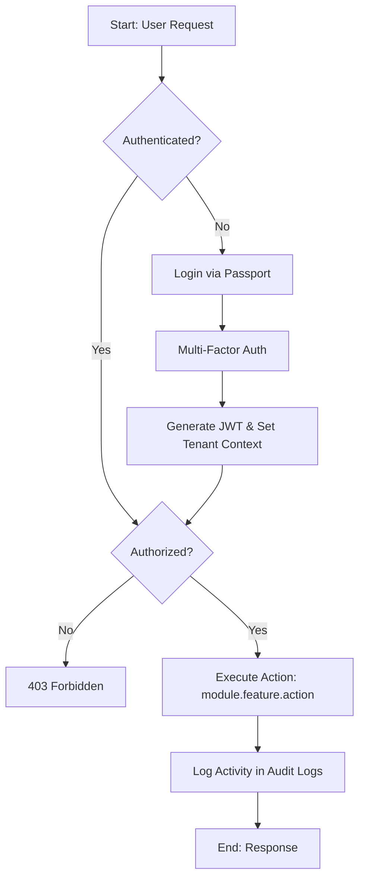

# IAM Workflow Flow

```mermaid
graph TD
    A[Start: User Request] --> B{Authenticated?}
    B -- No --> C[Login via Passport]
    C --> D[Multi-Factor Auth]
    D --> E[Generate JWT & Set Tenant Context]
    B -- Yes --> F{Authorized?}
    E --> F
    F -- No --> G[403 Forbidden]
    F -- Yes --> H[Execute Action: module.feature.action]
    H --> I[Log Activity in Audit Logs]
    I --> J[End: Response]
```
