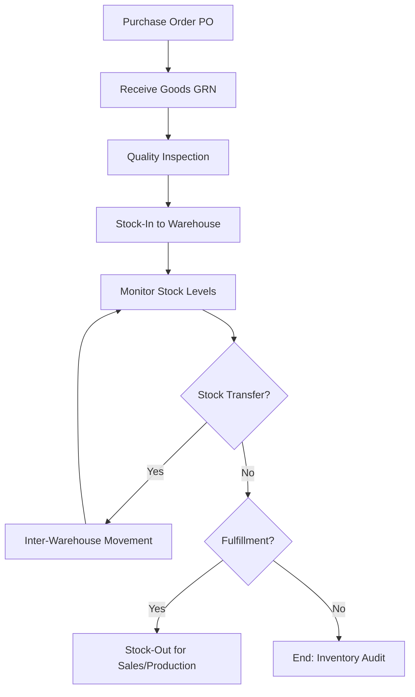

# Inventory Management Flow

```mermaid
graph TD
    A[Purchase Order PO] --> B[Receive Goods GRN]
    B --> C[Quality Inspection]
    C --> D[Stock-In to Warehouse]
    D --> E[Monitor Stock Levels]
    E --> F{Stock Transfer?}
    F -- Yes --> G[Inter-Warehouse Movement]
    F -- No --> H{Fulfillment?}
    G --> E
    H -- Yes --> I[Stock-Out for Sales/Production]
    H -- No --> J[End: Inventory Audit]
```
