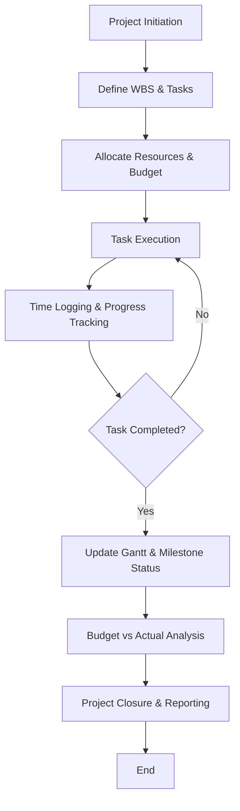

# Project Management Flow

```mermaid
graph TD
    A[Project Initiation] --> B[Define WBS & Tasks]
    B --> C[Allocate Resources & Budget]
    C --> D[Task Execution]
    D --> E[Time Logging & Progress Tracking]
    E --> F{Task Completed?}
    F -- No --> D
    F -- Yes --> G[Update Gantt & Milestone Status]
    G --> H[Budget vs Actual Analysis]
    H --> I[Project Closure & Reporting]
    I --> J[End]
```
