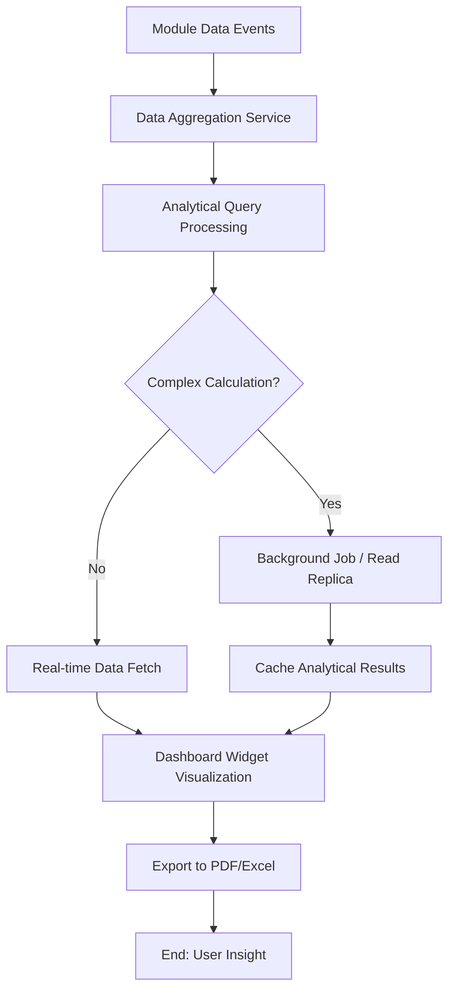

# Reporting & Analytics Flow

```mermaid
graph TD
    A[Module Data Events] --> B[Data Aggregation Service]
    B --> C[Analytical Query Processing]
    C --> D{Complex Calculation?}
    D -- Yes --> E[Background Job / Read Replica]
    D -- No --> F[Real-time Data Fetch]
    E --> G[Cache Analytical Results]
    F --> H[Dashboard Widget Visualization]
    G --> H
    H --> I[Export to PDF/Excel]
    I --> J[End: User Insight]
```
