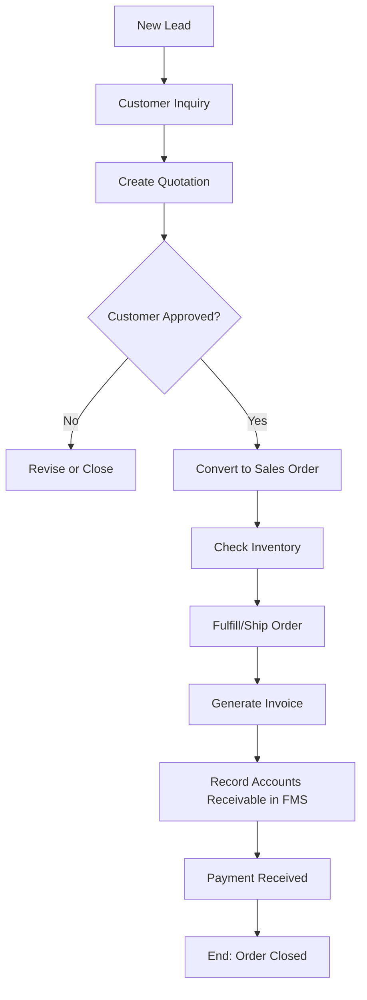

# Sales Workflow Flow (O2C)

```mermaid
graph TD
    A[New Lead] --> B[Customer Inquiry]
    B --> C[Create Quotation]
    C --> D{Customer Approved?}
    D -- No --> E[Revise or Close]
    D -- Yes --> F[Convert to Sales Order]
    F --> G[Check Inventory]
    G --> H[Fulfill/Ship Order]
    H --> I[Generate Invoice]
    I --> J[Record Accounts Receivable in FMS]
    J --> K[Payment Received]
    K --> L[End: Order Closed]
```
