# HRM Lifecycle & Payroll Flow

This diagram outlines the complete end-to-end employee journey within the Enterprise ERP's HRM ecosystem, integrating the detailed recruitment sub-processes with Workforce, Leave, Payroll, and Performance.

```mermaid
flowchart TD
    subgraph RecruitmentModule ["Recruitment & ATS Module (recruitment/flow.md)"]
        A[Sourcing: Job Requisitions & Candidate Sourcing] --> B[Application: CV Submission & Resume Parsing]
        B --> C[Screening: AI Screening & Phone Assessment]
        C --> D[Assessment: Secure Candidate Magic-Link & Sandboxed Quiz]
        D --> E[Interviews: Self-Scheduling, Tech & Panel Rounds]
        E --> F[Offer: Prep, eSignatures, and Negotiation]
    end

    subgraph WorkforceModule ["Workforce & Org Management"]
        F --> G[Onboarding: IT Setup, Pre-Onboarding & Orientation]
        G --> H[Personnel File: Unified Profile & Org Structure]
        H --> I[Time & Attendance: Attendance Logs & Tracking]
        I --> J[Leave Management: Accrual & eApprovals Integration]
    end

    subgraph PayrollModule ["Payroll & Compliance Engine"]
        J --> K[Run Payroll Engine: Pre-Calculations & Earnings]
        K --> L[Taxes & Compliance: Statutory Deductions & NSSF]
        L --> M[Disbursement: Payslip Generation & Bank Transfer File]
    end

    subgraph RetentionModule ["Retention & Performance Appraisals"]
        M --> N[Performance: Periodic Appraisals & OKR Tracking]
        N --> O[Offboarding: Resignation, Separation & Auditing]
    end

    %% Style Theme
    classDef default fill:#fdfdfd,stroke:#94a3b8,stroke-width:1px;
    classDef stage fill:#f8fafc,stroke:#475569,stroke-width:1.5px,color:#0f172a;
    classDef process fill:#f1f5f9,stroke:#0284c7,stroke-width:1.5px,color:#0369a1;

    class A,B,C,D,E,F,G,H,I,J,K,L,M,N,O process;
    class RecruitmentModule,WorkforceModule,PayrollModule,RetentionModule stage;
```

---

## **Workflow Stages Description**

### **1. Recruitment & ATS**
Operates as mapped in the detailed submodule at [recruitment/flow.md](./recruitment/flow.md). Manages the vacancy lifecycle, candidates applications, magic-link assessment portals, structured feedback, and offer handoffs.

### **2. Workforce Management**
Establishes the unified personnel profile, department-position mapping, leaves balance calculations, and time tracking. Transitions accepted offers smoothly into active personnel files.

### **3. Payroll & Compliance**
Automates monthly cycles based on verified attendance and leave records. Computes net pay, statutory compliance taxes (such as NSSF in Cambodia), delivers digital payslips, and posts journal entries to the FMS.

### **4. Performance & Separation**
Orchestrates ongoing growth and eventual offboarding via scheduled reviews, 360 feedback panels, OKR evaluation, and secure exit audits.
